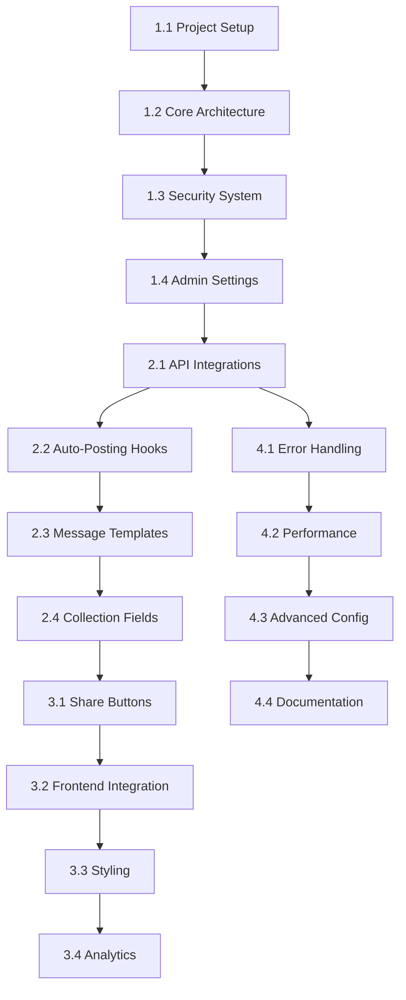

# PayloadCMS Social Media Plugin - Development Phases

## Phase 1: Foundation & Infrastructure (Weeks 1-2)

### Task 1.1: Project Setup (3 days)
**Priority**: Critical
**Estimated Time**: 3 days
**Dependencies**: None

#### Subtasks:
- [ ] Create new repository from PayloadCMS plugin template
- [ ] Configure development environment with proper tooling
- [ ] Set up package.json with correct metadata and dependencies
- [ ] Configure TypeScript, ESLint, and Prettier
- [ ] Set up GitHub Actions for CI/CD pipeline
- [ ] Create initial README and CONTRIBUTING.md
- [ ] Set up development database and test environment

**Deliverables**:
- Functional plugin template with development environment
- CI/CD pipeline configuration
- Initial documentation structure

### Task 1.2: Core Plugin Architecture (4 days)
**Priority**: Critical
**Estimated Time**: 4 days
**Dependencies**: Task 1.1

#### Subtasks:
- [ ] Define TypeScript interfaces and types
- [ ] Create main plugin export function with options
- [ ] Implement plugin configuration merging logic
- [ ] Set up error handling and logging utilities
- [ ] Create plugin option validation system
- [ ] Implement proper plugin cleanup and teardown

**Deliverables**:
- `src/index.ts` - Main plugin entry point
- `src/types.ts` - Complete TypeScript definitions
- Plugin options validation and error handling

### Task 1.3: Security & Encryption System (3 days)
**Priority**: High
**Estimated Time**: 3 days
**Dependencies**: Task 1.2

#### Subtasks:
- [ ] Implement AES encryption for API keys
- [ ] Create secure key derivation from PayloadCMS secret
- [ ] Add field-level encryption hooks
- [ ] Implement secure key masking in admin interface
- [ ] Create security audit utilities
- [ ] Add proper error handling for encryption failures

**Deliverables**:
- `src/utils/encryption.ts` - Encryption utilities
- Secure API key storage system
- Admin interface security measures

### Task 1.4: Admin Settings Global Collection (5 days)
**Priority**: Critical
**Estimated Time**: 5 days
**Dependencies**: Task 1.3

#### Subtasks:
- [ ] Create SocialMediaSettings global collection schema
- [ ] Implement conditional field display logic
- [ ] Add rich text instructions for each platform
- [ ] Create custom masked input component
- [ ] Implement connection testing UI component
- [ ] Add field validation and error messages
- [ ] Create settings backup/restore functionality

**Deliverables**:
- `src/collections/SocialMediaSettings.ts` - Settings collection
- `src/components/admin/MaskedKeyField.tsx` - Secure input component
- `src/components/admin/ConnectionTestButton.tsx` - Connection testing
- Complete admin settings interface

## Phase 2: Core Functionality (Weeks 3-4)

### Task 2.1: Social Media API Integrations (8 days)
**Priority**: Critical
**Estimated Time**: 8 days (2 days per platform)
**Dependencies**: Task 1.4

#### Subtasks:

**Twitter/X Integration (2 days)**:
- [ ] Implement Twitter API v2 client
- [ ] Create tweet posting functionality
- [ ] Add image upload support
- [ ] Implement rate limit handling
- [ ] Add connection testing endpoint

**Facebook Integration (2 days)**:
- [ ] Implement Facebook Graph API client
- [ ] Create page posting functionality
- [ ] Add image and link preview support
- [ ] Handle Facebook-specific formatting
- [ ] Add page selection and validation

**LinkedIn Integration (2 days)**:
- [ ] Implement LinkedIn API client
- [ ] Create organization posting functionality
- [ ] Add rich media support
- [ ] Handle LinkedIn content formatting
- [ ] Add organization validation

**Instagram Integration (2 days)**:
- [ ] Implement Instagram Basic Display API
- [ ] Create story and feed posting via Facebook API
- [ ] Add image optimization and requirements
- [ ] Handle Instagram content restrictions
- [ ] Add business account validation

**Deliverables**:
- `src/services/twitter.ts` - Twitter API integration
- `src/services/facebook.ts` - Facebook API integration
- `src/services/linkedin.ts` - LinkedIn API integration
- `src/services/instagram.ts` - Instagram API integration
- Complete API testing suite

### Task 2.2: Auto-Posting Hook System (4 days)
**Priority**: Critical
**Estimated Time**: 4 days
**Dependencies**: Task 2.1

#### Subtasks:
- [ ] Implement afterChange hook for content publishing
- [ ] Create posting queue system with retry logic
- [ ] Add conditional posting based on collection settings
- [ ] Implement post status tracking and logging
- [ ] Create failure notification system
- [ ] Add posting preview functionality

**Deliverables**:
- `src/hooks/afterChange.ts` - Auto-posting hook
- `src/utils/queue.ts` - Reliable posting queue
- Post status tracking and error handling

### Task 2.3: Message Templating System (3 days)
**Priority**: High
**Estimated Time**: 3 days
**Dependencies**: Task 2.2

#### Subtasks:
- [ ] Create variable substitution engine
- [ ] Implement platform-specific formatting
- [ ] Add hashtag generation from tags
- [ ] Create template preview functionality
- [ ] Add character limit validation per platform
- [ ] Implement URL shortening integration

**Deliverables**:
- `src/utils/templates.ts` - Templating engine
- Platform-specific message formatting
- Character limit validation system

### Task 2.4: Collection Field Extensions (3 days)
**Priority**: Medium
**Estimated Time**: 3 days
**Dependencies**: Task 2.3

#### Subtasks:
- [ ] Create social sharing configuration field
- [ ] Implement per-post sharing settings
- [ ] Add custom message override functionality
- [ ] Create sharing preview component
- [ ] Add publishing status indicators
- [ ] Implement bulk sharing operations

**Deliverables**:
- `src/fields/socialSharingField.ts` - Collection field addition
- Per-content sharing configuration
- Admin interface enhancements

## Phase 3: Share Buttons & Frontend (Weeks 5-6)

### Task 3.1: Share Button Components (4 days)
**Priority**: High
**Estimated Time**: 4 days
**Dependencies**: Task 2.4

#### Subtasks:
- [ ] Create React share button components
- [ ] Implement multiple button styles (icons, buttons, minimal)
- [ ] Add platform-specific sharing URLs
- [ ] Create responsive design components
- [ ] Add accessibility features (ARIA labels, keyboard navigation)
- [ ] Implement analytics tracking hooks

**Deliverables**:
- `src/components/client/ShareButtons.tsx` - Share button component
- Multiple styling options
- Accessibility-compliant components

### Task 3.2: Frontend Integration System (3 days)
**Priority**: High
**Estimated Time**: 3 days
**Dependencies**: Task 3.1

#### Subtasks:
- [ ] Create field injection system for share buttons
- [ ] Implement conditional rendering logic
- [ ] Add position configuration (top/bottom/both)
- [ ] Create Next.js integration helpers
- [ ] Add SSR compatibility
- [ ] Implement client-side hydration

**Deliverables**:
- Frontend integration utilities
- Next.js compatible components
- Server-side rendering support

### Task 3.3: Styling and Customization (3 days)
**Priority**: Medium
**Estimated Time**: 3 days
**Dependencies**: Task 3.2

#### Subtasks:
- [ ] Create default CSS styling system
- [ ] Implement theme customization options
- [ ] Add CSS-in-JS support for flexibility
- [ ] Create custom styling documentation
- [ ] Add dark mode support
- [ ] Implement responsive breakpoint handling

**Deliverables**:
- Default styling system
- Customization options and documentation
- Responsive and accessible designs

### Task 3.4: Analytics and Tracking (2 days)
**Priority**: Low
**Estimated Time**: 2 days
**Dependencies**: Task 3.3

#### Subtasks:
- [ ] Implement share tracking system
- [ ] Add Google Analytics integration
- [ ] Create custom analytics events
- [ ] Add click-through rate tracking
- [ ] Implement privacy-compliant tracking
- [ ] Create analytics dashboard component

**Deliverables**:
- Analytics tracking system
- Privacy-compliant event tracking
- Optional analytics dashboard

## Phase 4: Advanced Features & Polish (Weeks 7-8)

### Task 4.1: Error Handling & Resilience (3 days)
**Priority**: Critical
**Estimated Time**: 3 days
**Dependencies**: All previous tasks

#### Subtasks:
- [ ] Implement comprehensive error catching
- [ ] Create retry logic with exponential backoff
- [ ] Add graceful degradation for API failures
- [ ] Implement error notification system
- [ ] Create detailed error logging
- [ ] Add health check endpoints

**Deliverables**:
- Robust error handling system
- Retry and recovery mechanisms
- Comprehensive logging and monitoring

### Task 4.2: Performance Optimization (2 days)
**Priority**: High
**Estimated Time**: 2 days
**Dependencies**: Task 4.1

#### Subtasks:
- [ ] Optimize database queries and hooks
- [ ] Implement caching for API responses
- [ ] Add lazy loading for admin components
- [ ] Optimize bundle size and code splitting
- [ ] Implement performance monitoring
- [ ] Add resource usage optimization

**Deliverables**:
- Optimized performance metrics
- Caching and lazy loading implementation
- Performance monitoring tools

### Task 4.3: Advanced Configuration Options (3 days)
**Priority**: Medium
**Estimated Time**: 3 days
**Dependencies**: Task 4.2

#### Subtasks:
- [ ] Add webhook integration for external services
- [ ] Implement custom endpoint creation
- [ ] Create bulk operation utilities
- [ ] Add import/export functionality for settings
- [ ] Implement multi-environment configuration
- [ ] Create advanced scheduling options

**Deliverables**:
- Webhook and external service integration
- Advanced configuration options
- Multi-environment support

### Task 4.4: Documentation and Examples (4 days)
**Priority**: Critical
**Estimated Time**: 4 days
**Dependencies**: Task 4.3

#### Subtasks:
- [ ] Create comprehensive API documentation
- [ ] Write step-by-step setup guides
- [ ] Create video tutorials for each platform
- [ ] Build interactive examples and demos
- [ ] Write troubleshooting guides
- [ ] Create migration guides from WordPress plugins

**Deliverables**:
- Complete documentation website
- Video tutorial series
- Interactive examples and demos
- Troubleshooting and migration guides

## Task Dependencies Overview

## Milestone Schedule

### Week 2 Milestone: Foundation Complete
- Plugin template and development environment ready
- Core architecture and security system implemented
- Admin settings interface functional

### Week 4 Milestone: Core Features Complete
- All social media API integrations working
- Auto-posting system operational
- Message templating and collection fields implemented

### Week 6 Milestone: Frontend Complete
- Share button components implemented
- Frontend integration system working
- Styling and customization options available

### Week 8 Milestone: Release Ready
- Error handling and performance optimized
- Advanced features implemented
- Complete documentation and examples available

## Risk Mitigation

### Technical Risks
- **API Changes**: Monitor social media platform API updates weekly
- **Rate Limiting**: Implement conservative rate limiting with user notifications
- **Authentication Complexity**: Create detailed setup guides with video tutorials

### Timeline Risks
- **Scope Creep**: Maintain strict MVP focus, defer advanced features to post-release
- **Dependencies**: Plan alternative approaches for external API limitations
- **Testing Time**: Allocate 25% additional time for thorough testing

### Quality Assurance
- **Daily Stand-ups**: Track progress and identify blockers early
- **Weekly Reviews**: Assess quality and make necessary adjustments
- **Continuous Testing**: Implement automated testing throughout development
